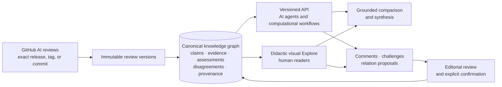

# ORAtlas UI/UX rules

> **ORAtlas is one canonical knowledge graph built from preserved, versioned AI-generated scientific
> reviews, with two equally important ways to consume it: agents through the API and people through
> a simple, didactic, visual interface.**

This file is the normative UI, API-access, and release contract. See
[`docs/product-experience.md`](docs/product-experience.md) for the wider information architecture and
scientific semantics.

**Design invariant:** the website is not the database, and the API is not a secondary export of the
website. Both expose the same identities, versions, relationships, provenance, and governance state.
Agents must never need to scrape the GUI; people must never need to understand the graph schema
before they can explore it.

## 1. Make the operating model obvious

A first-time visitor should understand within ten seconds that:

- reviews originate in **public GitHub repositories** built with, forked from, or compatible with
  the official
  [AllenNeuralDynamics Computational Review Template](https://github.com/AllenNeuralDynamics/ComputationalReviewTemplate);
- ORAtlas captures an **exact release, tag, or commit**, not a manuscript upload;
- accepted reviews become immutable source records whose claims, evidence, assessments,
  disagreements, and provenance form a knowledge graph;
- public records are available through both a visual website and a documented machine API;
- GitHub sign-in is required for deposit and attributable participation, not ordinary reading of
  public records; and
- archive acceptance is an **editorial decision**, not peer review, correctness, or consensus.

The primary human actions are **Reviews**, **Explore**, **Compare**, and **Create & deposit**. A visible
**API & agents** entry point must lead directly to documentation, schemas, examples, and endpoints.

### Five-step author flow

1. Create a repository from the AllenNeuralDynamics template.
2. Configure the scope and run the review pipeline.
3. Check the review, evidence packages, figures, provenance, and pipeline gates; do not present
   partial output as complete.
4. Push the repository and publish an immutable tag or GitHub release. A Zenodo DOI is recommended,
   not required.
5. Sign in to ORAtlas, select the exact source version, verify the extracted metadata and validation
   report, and deposit it for acceptance, changes, or rejection.

## 2. Design one graph for two first-class interfaces

### 2.1 AI agents and computational workflows: API first

- The API is a complete product surface. An agent can discover reviews, retrieve immutable versions,
  enumerate claims and evidence, traverse typed relations, inspect assessments and disagreements,
  and follow update lineage **without a web page, browser session, or DOM scraping**.
- Publish a prominent API landing page with an OpenAPI contract, machine-readable schemas,
  authentication and rate-limit rules, and a copyable quick start:
  **retrieve review → list claims → traverse evidence → inspect provenance and disagreements**.
- Public accepted records should be readable without GitHub authentication unless a documented
  safety or rate-limiting exception applies. Authenticated writes remain attributable.
- Use stable canonical identifiers and versioned endpoints and schemas. Every response identifies the
  exact entity version, provenance, lifecycle state, relation state, and corresponding human page.
- Use database-native cursor pagination for every node and edge collection. Every bounded response
  states whether it is complete, truncated, filtered, or still pageable.
- Expose a versioned graph snapshot and change feed so agents can synchronize incrementally.
  Deterministic filters, ordering, errors, and idempotent writes are part of the agent UX.
- The API and GUI must use the same canonical graph or immutable event/store. A GUI-only core action
  is an incomplete feature; optional identity bridges must not become permanent architecture.

### 2.2 Human readers: didactic, visual, and personalized

- Start from a plain-language question, topic, review, or declared interest. Offer a small number of
  explanatory starter paths rather than opening on a dense, unlabelled graph.
- Treat the graph as an **explanatory map**, not a decorative node cloud. Consistent visual semantics
  distinguish reviews, claims, evidence, assessments, disagreements, datasets, code, versions, and
  proposed versus confirmed relations.
- Every visible node or edge should answer: **What is this? Why am I seeing it? What supports it? How
  does it connect to earlier knowledge? What changed?** Plain-language explanations precede
  specialist metadata.
- Make new-to-old connections explicit through typed relations such as **confirms, contradicts,
  extends, updates, reuses evidence from**, or **no confirmed connection**. Never manufacture a link
  merely to avoid an isolated node.
- Use progressive disclosure: explanatory path first, source review and claim passport second, full
  graph indexes and specialist controls on demand. The complete review remains easy to read.
- Personalization may use explicitly selected interests, domains, preferred depth, or saved topics.
  It must be transparent, reversible, and explain every recommendation. It changes ranking and
  presentation, never canonical graph state. An unpersonalized view and reset control remain
  available.
- Preserve orientation: the active question, selected path, source review, graph neighbourhood, and
  return route remain visible. Provide labels, legends, keyboard access, non-colour cues, responsive
  layouts, and a readable non-graph alternative.

## 3. Preserve records and govern participation

- The archived review is primary. Figures and plots remain readable, expandable, captioned, and
  linked to exact source provenance.
- The default evidence path is **review → claim → evidence → assessment or disagreement → preserved
  source context**. Repository, commit/tag/release, version, AI/run provenance, and editorial status
  remain visible.
- Comments may address a review, exact claim, claim–evidence relation, or preserved passage. Clearly
  distinguish discussion, formal challenge, TRUST assessment, editorial decision, and graph-change
  proposal.
- A comment never edits an accepted review. Resolution links to an answer, editorial decision, or
  replacement GitHub version with diff and lineage. Historical discussions remain readable;
  moderation leaves an auditable tombstone.
- Reviews, versions, claims, evidence, assessments, discussions, and typed relations are canonical
  graph entities with stable identities and immutable versions, or are generated from one canonical
  immutable store.
- Humans and LLMs may propose a relation; only an explicit editor-confirmed proposal becomes a
  canonical edge. A comment is not automatically an edge, and an editor-approved isolated concept
  is valid.
- Every node and edge exposes provenance, exact version, attribution, rationale, status
  (`proposed` or `confirmed`), and change history. Semantic similarity may suggest a link but never
  silently merges identities, sources, or conflicting interpretations.
- Safe rendering never executes repository HTML, iframes, styles, or plugins. Passage annotations
  are version-bound, source-anchored, and available to agents in machine-readable form.

## 4. Turn exploration into grounded, reviewable synthesis

- Explore and Atlas Discuss form one workflow: the selected graph path and source records remain
  visible before or beside any generated answer.
- Cross-review synthesis uses canonical identities, confirmed relations, or clearly labelled
  proposals. Shared sources are grouped so repeated citation does not create false consensus;
  disagreements, scope differences, missing evidence, and uncertainty remain visible.
- Every generated statement cites exact node versions, source reviews, and its supporting graph path.
  Model/provider, task or prompt, run, evidence packet, and generation status are inspectable through
  both GUI and API.
- An LLM may propose links or draft synthesis. It may not rewrite a preserved review or confirm an
  edge. A saved or published synthesis is a separate, versioned derivative record with source
  lineage, software provenance, staleness detection, and an accountable editorial decision.

## 5. End-to-end release gates

A route, diagram, or button is not sufficient. Verify these journeys with real, non-demo records:

1. Home → Create & deposit → Allen template guidance → GitHub sign-in → exact-version capture →
   validation → editorial status → public immutable review.
2. Full review and figures → claim → evidence → assessment/disagreement → provenance.
3. API documentation → copyable quick start → retrieve a real review → list claims → traverse
   evidence and disagreement records, without the GUI.
4. Paginate real node and edge collections with explicit completeness metadata; obtain a graph
   snapshot and consume a versioned change-feed event.
5. Question or declared interest → explained starter paths → reason for each recommendation → full
   unpersonalized result set and reset control.
6. Newly accepted review → confirmed, contradicted, extended, updated, reused, proposed, or absent
   links to older insights → supporting evidence and provenance.
7. Claim or passage → comment → reply → challenge or relation proposal → editorial resolution or new
   version → diff, graph transition, and lineage.
8. Explore at least two reviews → grounded multi-review answer → exact source highlighting → saved or
   published synthesis without mutating source reviews.
9. Confirm that the same entities, proposals, status changes, and synthesis records appear through
   API and GUI with identical canonical identities.

Fail the release when a core action is a placeholder, demo content appears real, an accepted review
cannot be read in full, an agent must scrape HTML, a bounded API response hides truncation,
personalization cannot be reset, a graph link lacks an explanation, or an LLM statement cannot
resolve to exact source versions.

## Language rules

Use **canonical knowledge graph**, **API & agents**, **visual Explore**, **deposit repository**,
**accepted into the archive**, **AI-generated synthesis**, **proposed relation**, and
**editor-confirmed relation**. Avoid **upload paper**, **peer-reviewed**, **truth score**, or
**consensus** unless the underlying record explicitly supports that wording.
