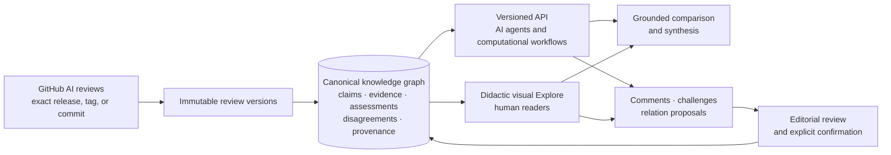

# ORAtlas UI/UX rules

> **ORAtlas is a knowledge graph built from preserved, versioned AI-generated scientific reviews.**
> Its data has two equally important consumers: software agents through the API and people through a
> simple, didactic, visual exploration interface.

This file is the normative UI, API-access, and release contract. See
[`docs/product-experience.md`](docs/product-experience.md) for the wider information architecture,
scientific semantics, and current implementation boundary.

**Design invariant:** ORAtlas has one canonical graph and two first-class product surfaces. The
website is not the database, and the API is not a secondary export of the website. Both expose the
same identities, versions, relationships, provenance, and governance state. Agents must never need
to scrape the GUI; people must never need to understand the graph schema before they can explore it.

## 1. Make the operating model obvious

A first-time visitor should understand within ten seconds that:

- reviews originate in **public GitHub repositories** built with, forked from, or compatible with
  the official
  [AllenNeuralDynamics Computational Review Template](https://github.com/AllenNeuralDynamics/ComputationalReviewTemplate);
- ORAtlas captures an **exact release, tag, or commit** rather than accepting a manuscript upload;
- accepted reviews become immutable source records from which claims, evidence, assessments,
  disagreements, and provenance are represented in the knowledge graph;
- public records are available both through a visual website and a documented machine API;
- GitHub sign-in is required for deposit and attributable participation, not for ordinary reading of
  public accepted records; and
- archive acceptance is an **editorial decision**, not peer review, correctness, or consensus.

The primary human actions are **Reviews**, **Explore**, **Compare**, and **Create & deposit**. A clearly
visible **API & agents** entry point must provide documentation, schemas, examples, and machine
endpoints without requiring navigation through the visual interface.

### Five-step author flow

1. Create a repository from the AllenNeuralDynamics template.
2. Configure the title and scope, then run the template review pipeline.
3. Check the review, evidence packages, figures, provenance, and pipeline gates; do not present
   partial output as complete.
4. Push the complete repository and publish an immutable tag or GitHub release. A Zenodo DOI is
   recommended, not required.
5. Sign in to ORAtlas, paste the repository URL, choose the exact source version, verify the
   extracted metadata and validation report, and deposit it for acceptance, changes, or rejection.

## 2. Design for one graph and two consumption modes

### 2.1 AI agents and computational workflows: API first

The API is a complete product surface, not a convenience layer for the GUI.

- An agent must be able to discover accepted reviews, retrieve immutable versions, enumerate claims
  and evidence, traverse typed relations, inspect assessments and challenges, and follow update
  lineage **without opening a web page or maintaining a browser session**.
- Publish a prominent API landing page with an OpenAPI contract, machine-readable schemas, stable
  identifiers, authentication rules, rate-limit information, and copyable examples. The shortest
  quick start should demonstrate: **retrieve review → list claims → traverse evidence → inspect
  provenance and disagreements**.
- Public accepted records should be readable without GitHub authentication unless a documented
  safety or rate-limiting exception applies. Authenticated writes must remain attributable.
- Version endpoints and schemas. Every response identifies the canonical entity, exact version,
  provenance, lifecycle status, relation status, and corresponding human-readable URL.
- Use database-native cursor pagination for every node and edge collection. Every bounded response
  states whether it is complete, truncated, filtered, or still pageable; silent partial results are
  forbidden.
- Expose a versioned graph snapshot and change feed so agents can synchronize incrementally rather
  than repeatedly recrawling the archive.
- Deterministic filters, ordering, error semantics, and idempotent write operations are part of the
  UX for agents. A GUI-only action is an incomplete feature.
- The API and website must be generated from the same canonical graph or immutable event/store.
  Optional identity bridges between separate review, claim, evidence, discussion, and graph models
  must not become permanent architecture.

### 2.2 Human readers: didactic, visual, and progressively disclosed

The human interface should make the current knowledge space understandable before making it
comprehensive.

- Begin with a plain-language question, topic, review, or declared interest. Offer a small number of
  explanatory starter paths rather than opening on a dense, unlabelled graph.
- Treat the graph as an **explanatory map**, not a decorative node cloud. Consistent visual semantics
  must distinguish reviews, claims, evidence, assessments, disagreements, datasets, code, people,
  versions, and proposed versus confirmed relations.
- Every visible node or edge should answer: **What is this? Why am I seeing it? What supports it? How
  does it connect to prior knowledge? What changed?** Plain-language explanations precede specialist
  metadata.
- Make the connection between new and old knowledge explicit. A newly accepted review or claim
  should show whether it confirms, contradicts, extends, updates, reuses evidence from, or remains
  unconnected to earlier records. Never manufacture a relation merely to avoid an isolated node.
- Use progressive disclosure: explanatory path first, source review and claim passport second, full
  graph indexes and specialist controls on demand. The complete canonical result set remains
  accessible.
- Personalization may use explicitly selected interests, scientific domains, preferred depth, or
  saved topics. It must be transparent, reversible, and explain why each item was recommended.
  Personalization changes ranking and presentation, never canonical graph state. An unpersonalized
  view and reset control must always be available.
- Preserve orientation while navigating. The active question, selected path, source review, graph
  neighbourhood, and return route remain visible; users should not fall into disconnected detail
  pages.
- Visual encodings require labels, legends, keyboard access, non-colour cues, responsive layouts,
  and a readable alternative representation.

## 3. Preserve the review first and anchor participation

- The complete review must remain easy to read; the graph and Atlas Discuss must not replace or bury
  it. Figures and plots must be readable, expandable, captioned, and linked to exact source
  provenance.
- The default evidence path is **review → claim passport → evidence → assessment or disagreement →
  preserved source context**. Repository, release/tag/commit, version, AI/run provenance, and
  editorial status remain visible.
- Comments may address the whole review, an exact claim, or a selected passage in a preserved MyST
  page. Formal challenges may target an exact claim, claim–evidence relation, or assessment
  criterion.
- Support attributed questions, concerns, suggestions, endorsements, and one-level replies. Clearly
  distinguish open discussion, formal challenge, TRUST assessment, editorial decision, and proposed
  graph change.
- A comment never edits an accepted review in place. An addressed suggestion must link to its
  resolution, replacement GitHub version, diff, and lineage. Historical-version discussions remain
  readable but read-only; moderation leaves an auditable tombstone.
- Graphs disclose why records appear, result bounds or truncation, and honest empty states. Demo
  content is unmistakably labelled.

### Current safe-rendering boundary

The reader captures the Markdown and notebook files explicitly listed by the pinned `myst.yml`
table of contents, parses them into a sanitized MyST AST, and renders source TRUST v2 assertions as
a provenance-distinct layer. Repository HTML, iframes, styles, and plugins are never executed.
Relative figures resolve against the exact accepted commit. Passage comments store a source hash,
page path, rendered-text position, and quote-with-context selector. They are version-bound,
highlighted in the reader, and exposed as public W3C-style JSON-LD annotations for agents. A reply
inherits its parent passage; neither comments nor annotations mutate the archived source.

## 4. Let the knowledge graph evolve without hidden mutation

- Reviews, immutable versions, claims, evidence, figures, datasets, code, assessments, discussions,
  and typed relationships are canonical graph entities with stable identities and immutable
  versions, or are generated from one canonical immutable store.
- Comments, challenges, and update or link proposals are attributable records anchored to exact
  graph subjects. **A comment is not automatically a scientific graph edge.**
- Humans and LLMs may propose a relationship; only an explicit editor-confirmed proposal becomes a
  public canonical edge. Never invent an edge to force connectivity. An editor-approved new root or
  isolated concept is valid.
- Every node and edge exposes provenance, exact version, status (`proposed` or `confirmed`),
  attribution, rationale, and change history. Semantic similarity may suggest a link but never
  silently merges identities, evidence works, or conflicting interpretations.
- New versions add history rather than replacing it. The interface and API must make additions,
  corrections, withdrawals, retractions, supersession, and unresolved disagreement visible.
- Visual graph changes and API change-feed events must describe the same transition and resolve to
  the same canonical identities.

## 5. Turn exploration into grounded, reviewable synthesis

- Explore starts from an explicit question, topic, review, or interest and offers a small set of
  explanatory paths. The selected graph path and source records remain visible before or beside
  Atlas Discuss.
- Cross-review synthesis uses canonical identities, confirmed relations, or clearly labelled
  reviewable proposals. Shared underlying sources are grouped so repeated citation does not create
  false consensus; disagreements, scope differences, missing evidence, and uncertainty remain
  visible.
- Every generated statement cites exact node versions and source reviews and highlights its
  supporting graph path. Model/provider, task or prompt, run, evidence packet, and generation status
  are inspectable through both GUI and API.
- An LLM may propose links or draft a synthesis. It may not rewrite a preserved review or confirm an
  edge. A saved or published synthesis is a **separate, versioned derivative record** with source
  lineage, software provenance, staleness detection, and an accountable editorial decision.
- A synthesis may connect insights across reviews, but it must preserve competing interpretations
  rather than collapsing them into one answer. Missing or weak connections are findings, not UI
  failures.

## 6. End-to-end release gates

A route, diagram, or button is not sufficient. Releases must verify these journeys with real,
non-demo accepted records.

### Deposit and preservation

1. Home → review archive → Create & deposit → Allen template guidance → clear deposit instructions.
2. GitHub sign-in → repository inspection → exact-version capture → validation → editorial status →
   public immutable review.
3. Full review and figures → claim → evidence → assessment/disagreement → provenance.

### Agent/API consumption

4. API documentation → copyable quick start → retrieve a real accepted review → list its claims →
   traverse evidence and disagreement records, without using the GUI.
5. Paginate real node and edge collections with explicit completeness metadata; obtain a graph
   snapshot and consume at least one versioned change-feed event.
6. Resolve every API entity and relation to its exact source version, provenance, lifecycle state,
   and human-readable record.

### Human exploration and personalization

7. Start from a question or declared interest → receive a small set of explained paths → inspect why
   each path was selected → switch to the complete unpersonalized result set.
8. Open a newly accepted review → see confirmed, contradicted, extended, updated, reused, proposed,
   or absent connections to older insights → inspect the supporting evidence and provenance.
9. Navigate visual graph → full review → claim passport → evidence → prior context → back to the
   original path without losing orientation.

### Participation, governance, and synthesis

10. Select a preserved passage or claim → attributed comment → reply → formal challenge or relation
    proposal → editorial resolution or new version → diff, graph transition, and lineage.
11. Explore at least two reviews → grounded multi-review answer → exact source highlighting → draft
    or published synthesis, without mutating source reviews.
12. Confirm that the same proposal, status change, and synthesis record are visible through both API
    and GUI with identical canonical identities.

Fail the release when a core action is a placeholder, demo content appears real, the graph shows
unrelated records without explanation, an accepted review cannot be read in full, an agent must
scrape HTML, a bounded API response hides truncation, personalization cannot be reset, or an LLM
statement cannot resolve to exact source versions.

## Language rules

Use **canonical knowledge graph**, **API & agents**, **visual Explore**, **deposit repository**,
**accepted into the archive**, **AI-generated synthesis**, **proposed relation**, and
**editor-confirmed relation**. Avoid **upload paper**, **peer-reviewed**, **truth score**, or
**consensus** unless the underlying record explicitly supports that wording.
